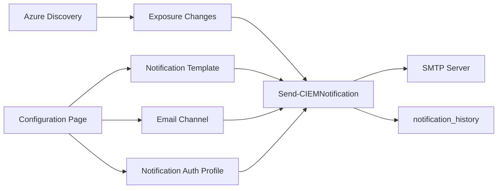

# Notifications Channels Feature

## Problem

CIEM can detect exposure changes, but it has no built-in way to notify users outside the dashboard. Security teams need exposure-change alerts delivered through a configurable channel. The first useful version should support email without coupling email authentication details to channel routing. The feature must remain read-only with respect to cloud and PAM systems.

## Technical Plan

The feature adds a `Devolutions.CIEM.Notifications` module area with notification-specific classes, database-backed CRUD commands, SMTP rendering/sending logic, and Configuration page controls. The Email channel points to a `NotificationAuthenticationProfile`, so SMTP server/auth settings live in a profile and recipient routing lives in the channel. `Send-CIEMNotification` reads the single enabled Exposure Change notification, filters exposure changes, renders text and HTML bodies, sends through the enabled Email channel, and records simple rows in `notification_history`.

## Alternatives Considered

Generic authentication profiles for Azure, AWS, and notifications were considered. That would reduce conceptual duplication, but Azure and AWS currently use different cache-backed profile models and broad migration would expand the feature. V1 will add `CIEMNotificationAuthenticationProfile` only and leave existing provider auth unchanged.

A delivery-attempt class was considered for history. The chosen design stores history as simple rows and returns PSCustomObjects because delivery history is audit data, not a domain object requiring class behavior.

Seeding a default notification was considered. The chosen design creates tables only; users create the single notification and email channel from Configuration.

## Detailed Implementation

**`docs/designs/notifications-channels.md`** - created  
Rationale: Durable design record for the notification subsystem and its explicit scope boundaries.

**`psu-app/Data/module_roots.psdata`** - modified  
Rationale: Register `Devolutions.CIEM.Notifications` so classes and public/private commands are loaded.

**`psu-app/data/schema.sql`** - modified  
Rationale: Add idempotent notification auth profile, channel, notification, and history tables.

**`psu-app/modules/Devolutions.CIEM.Notifications/**`** - created  
Rationale: New module root for notification classes, public CRUD commands, send command, and private helpers.

**`psu-app/modules/Devolutions.CIEM.PSU/Pages/New-CIEMConfigPage.ps1`** - modified  
Rationale: Add Notifications UI section for auth profile, channel recipients, notification filters/templates, test email, and delivery history.

**`psu-app/modules/Devolutions.CIEM.PSU/Tests/Unit/PageCommandQualification.Tests.ps1`** - modified  
Rationale: Permit new notification commands used from PSU page endpoints, while still enforcing module qualification.

**`psu-app/modules/Devolutions.CIEM.Notifications/Tests/Unit/*.Tests.ps1`** - created  
Rationale: Pester coverage for schema, class structure, CRUD behavior, send behavior, history rows, and source-level discovery wiring.

**`psu-app/ui/e2e/pages/Configuration/ConfigurationPageHelpers.js`** - modified  
Rationale: Add selectors and helper methods for the Notifications section.

**`psu-app/ui/e2e/pages/Configuration/Configuration.test.js`** - modified  
Rationale: Add Configuration page coverage for notification fields, auth method-driven inputs, test email action, and history table visibility.

Ordering: tests are written and run before implementation; implementation then updates schema, module root, notification commands, Configuration UI, and discovery wiring. If an implementation discovery requires additional files, update this design before adding them.
