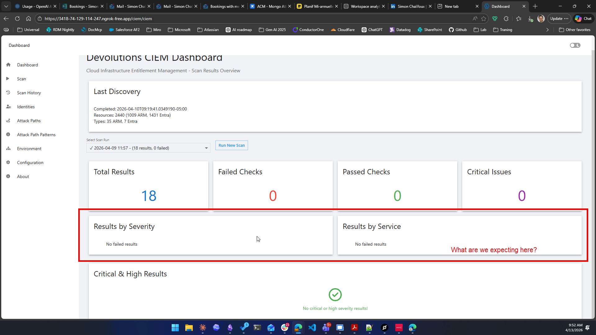
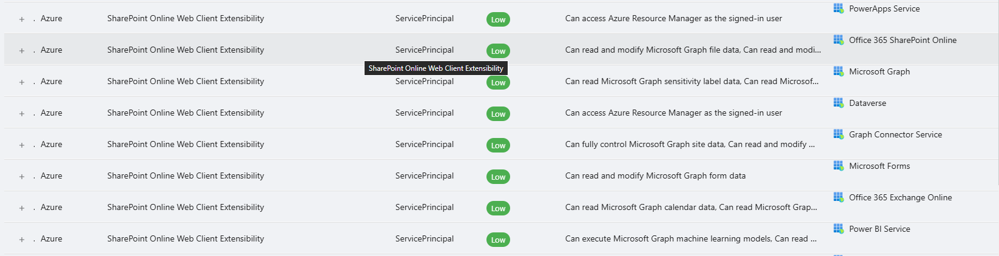
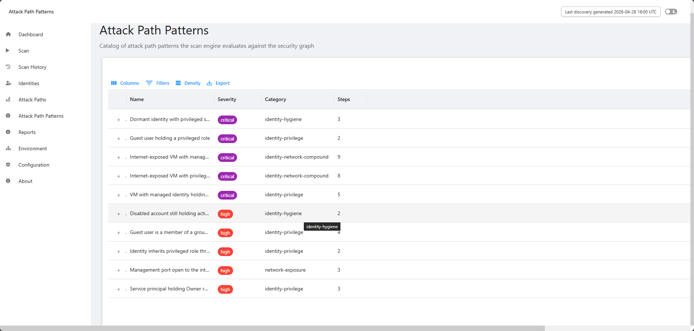

# Simon CIEM Feedback

Captured from Simon Chalifoux's Slack feedback in the Devolutions MPDM.

## Summary

Simon sees CIEM as promising for Azure customers and useful to the Devolutions security team, but his feedback points to three product shifts:

1. CIEM should not depend on users manually checking the dashboard. It needs scheduled discovery, exposure-change detection, and outbound signals that can land in SIEM, alerting, ticketing, email, webhooks, or PSU automation.
2. CIEM should support PAM implementation as a progress and value surface, not exist only as a standalone CIEM dashboard.
3. The UI needs to become easier to inspect at 1080p, especially identity rows, object identifiers, table column sizing, and pagination placement.

## Screenshots

### Dashboard Expectation

Simon asked what the dashboard was expected to show.

### Identity View Duplicate Principals

Simon attached this while asking why the same-looking principal appears multiple times and whether rows are flattened by target resource.

### Table Sizing And Pagination

Simon attached this while pointing out that important columns are truncated, the final single-digit column gets too much width, and pagination ends up off to the far right.

## Requested Changes And Product Signals

### 1. Dashboard Should Surface Current Outstanding Risk

Simon said the dashboard should show a light view of the current outstanding risks, especially attack path or identity risks, and what people should look at immediately.

Implementation meaning:

- Add a dashboard section for the highest-priority identity and attack path risks.
- Make the dashboard an entry point into investigation, not a static scan-results summary.
- Each highlighted item should link to the detailed identity, attack path, or scan result view.
- Include why the item matters: severity, impacted identity, target resource, inherited path, and evidence.

### 2. CIEM Needs Scheduled Discovery And Exposure-Change Alerting

Simon relayed security-team feedback that the dashboard is interesting as an investigation tool, but the missing product piece is surfacing new risk and pushing that signal into systems where security teams already work.

Implementation meaning:

- Add scheduled discovery scans using the same discovery pipeline as manual scans.
- Compare discovery snapshots to detect new exposure, removed exposure, and risk score increases.
- Generate alert-ready signal records locally first.
- Add connector payload previews before any external write/send behavior.
- Treat outbound delivery as explicitly scoped. Do not send to SIEM, ticketing, PAM, email, or webhooks until the target system and allowed operation are defined.

### 3. Dashboard Should Support PAM Implementation Progress

Simon sees a strong use case if CIEM can be used as a progress report for a PAM initiative rather than only a CIEM initiative by itself.

Implementation meaning:

- Add read-only PAM fit analysis to identify which findings are PAM candidates.
- Add a PAM progress view showing baseline exposure, current exposure, remaining standing privilege, accepted exceptions, and before/after evidence.
- Map CIEM findings to Devolutions PAM outcomes such as JIT access, approval workflows, access brokering, session governance, credential rotation, and privileged-account onboarding.
- Keep this as fit analysis and routing context unless write workflows are explicitly re-scoped.

### 4. Prioritize Active Directory And Entra ID Before AWS And GCP

Simon suggested that if CIEM becomes a PAM progress/value surface, Active Directory and Entra ID should be the next systems to integrate instead of going directly to AWS and GCP.

Implementation meaning:

- Keep Azure/Entra identity and entitlement depth ahead of broad cloud-provider expansion.
- Treat AWS/GCP expansion as secondary until the identity/PAM story is strong.
- Add AD/Entra correlation work where it improves PAM implementation visibility.

### 5. Validate Production PSU Deployment Logistics

Simon said Devolutions already has a PSU production instance, it appears to have a managed identity that can read Azure, and CIEM could be queued for deployment there. He also suggested a 30-minute sync with Samuel and Nicolas to discuss deployment logistics.

Implementation meaning:

- Prepare a deployment-readiness checklist before the sync.
- Validate required Azure read permissions for managed identity.
- Validate the PSU version, app model, storage path, schedule behavior, and module import path.
- Do not assume the current SQLite-backed storage is production-ready for every PSU topology.

### 6. Answer The SQLite / Multi-Instance Concern

Simon asked whether the disk-written SQLite database works when only a single PSU instance is running, and whether multi-instance customer deployments are a valid deployment shape.

Implementation meaning:

- Document the supported v1 deployment shape before production use.
- Treat a single PSU instance with a single CIEM database path as the first supported shape unless multi-instance behavior is tested.
- For multi-instance PSU, validate whether every node sees the same database path and whether CIEM scheduled/manual scans can avoid concurrent writers.
- If the production topology is multi-node, decide whether to constrain CIEM to one schedule runner/one write node or move CIEM state to a shared database design.

### 7. Identity View Should Be Identity-First

Simon expected the identity view's primary key to be the identity itself, not a composite of identity and target resource.

Implementation meaning:

- Redesign the top-level identity grid so one row represents one identity.
- Move target resources, entitlements, paths, and evidence into detail panels or nested grids.
- Keep target-resource filters available, but do not duplicate the principal as the main row identity for every target.

### 8. Identity View Must Show Object ID

Simon asked to see the Object ID of the identity because service principals and managed identities do not enforce unique names.

Implementation meaning:

- Add `Object ID` / `Principal ID` to the identity row, detail panel, or copy action.
- Make the ID visible enough to disambiguate duplicate display names.
- Add copy-to-clipboard behavior if the UI supports it cleanly.

### 9. Explain Duplicate-Looking Principals

Simon saw principals that looked the same multiple times and asked whether they are flattened based on target resource.

Implementation meaning:

- Remove duplicate-looking top-level rows by changing the identity page row model.
- If any duplicate rows remain due to distinct object IDs, make the Object ID and type visible.
- If target-resource flattening is still used in a nested view, label it clearly as target access, not identity identity.

### 10. Improve Table Column Sizing And Pagination

Simon said most tables truncate the important field, leave too much screen width on a final column that is often a single digit, and put pagination far to the right where horizontal scrolling is required.

Implementation meaning:

- Audit all CIEM tables/grids at 1080p.
- Give important text columns enough width or flex priority.
- Give numeric/status columns fixed compact widths.
- Avoid making pagination reachable only through horizontal scrolling.
- Verify the identity, attack paths, scan history, reports, scan selector, and dashboard critical/high result tables.

### 11. Scan Efficiency Matters At Large Customer Scale

Simon warned that customer Azure environments will be much larger than expected, so scans must be efficient.

Implementation meaning:

- Preserve the scan-efficiency work as a product requirement.
- Avoid N+1 API calls and avoid loading the full world repeatedly inside UI render paths.
- Add performance measurement around discovery phases before promising production readiness.

## Adam's Threaded Responses

Adam responded that scheduled discovery, notification ability, and connectors are viable additions. Adam also said he could investigate ways CIEM increases PAM value.

Adam also responded to the deployment sync suggestion by saying he needed to spend time testing deployment and the Azure instance first to ensure it is in good shape.

## Existing Repo Alignment

The current project direction already aligns with Simon's feedback:

- `docs/ciem-feature-todos.md` prioritizes scheduled discovery scans, exposure change detection, outbound risk signal delivery, read-only PAM fit analysis, and a PAM implementation progress view.
- `psu-app/modules/Devolutions.CIEM.PSU/Pages/New-CIEMDashboardPage.ps1` already has a dashboard surface, but it is still organized around checks/scans and identity stats rather than an urgent risk queue.
- `psu-app/modules/Devolutions.CIEM.PSU/Pages/New-CIEMIdentitiesPage.ps1` currently creates identity-grid rows from effective permissions, which explains why one principal can appear multiple times across target resources and entitlements.
- `docs/psu-docs/apps/components/data-display/table.md` confirms PSU table columns can define width and truncation behavior.
- `docs/psu-docs/automation/schedules.md` confirms PSU schedules can run scripts on CRON, one-time, continuous, selected environments, and selected computers.
